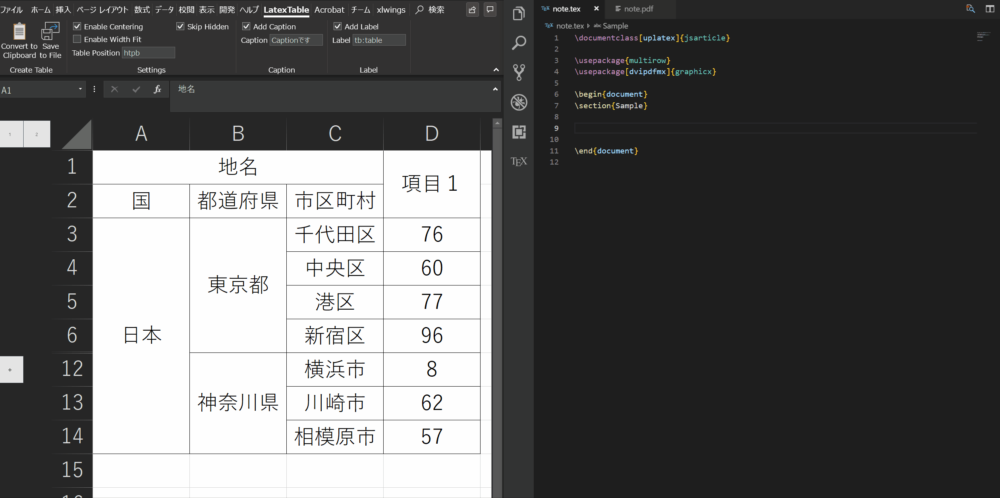

# LaTexTable

## 基本機能
Excelの選択範囲をLaTexの表に変換してクリップボードに渡す。

## 対応していること
- 選択範囲をLaTexの表としてクリップボードに貼り付ける
- 選択範囲をLaTexの表としてファイルに保存する
  - 複雑な表だと本文中に置くとかなり邪魔なので別ファイルにしてincludeするとき
- 基本的な表のオプションを指定する
  - 表を中央に寄せるか
  - 表を本文中のどこに優先的に配置するか
  - ラベルの指定
  - キャプションの指定
- Excel表の非表示行(又は列)が選択範囲に含まれている場合LaTexでも非表示にするか
- 一度設定した内容を設定ファイルとして保存することで再度Excelを開いたときにも設定内容を保持

